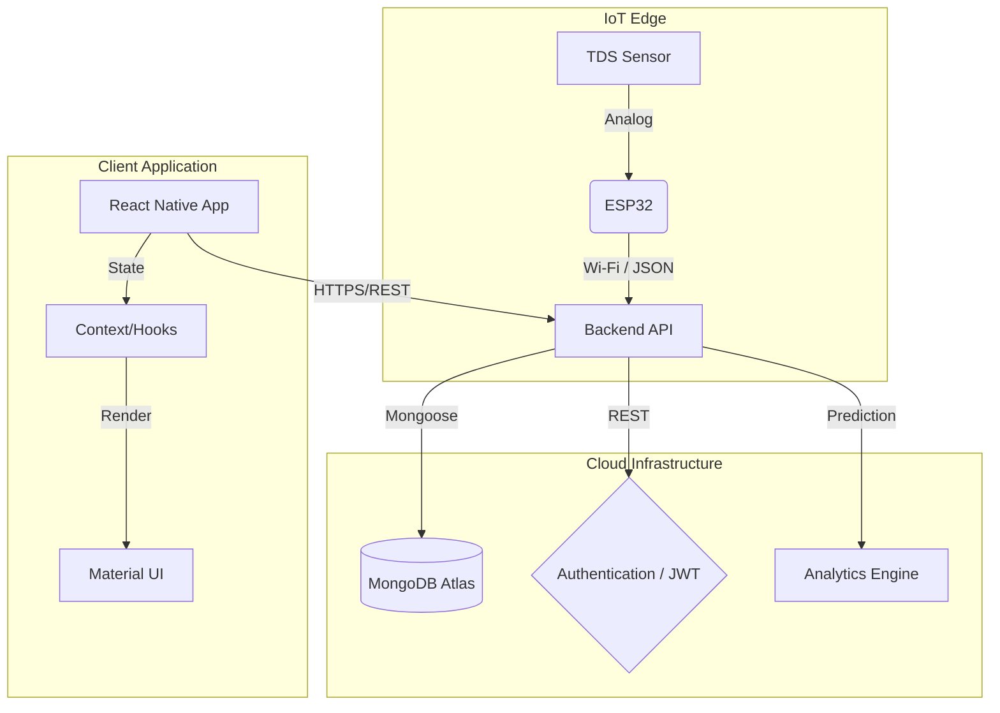

<div align="center">
  <h1>💧 AquaSense</h1>
  <p><strong>IoT-Based RO Water Quality Monitoring & Predictive Analysis System</strong></p>
  <p>A production-quality React Native (Expo) + Node.js application for real-time water quality monitoring via ESP32 TDS sensors, with predictive analytics and Material Design 3 UI.</p>
  
  <p>
    
    
    
    
    
    
  </p>
</div>

---

## 📋 Table of Contents
- [Features](#-features)
- [Architecture](#-architecture)
- [Tech Stack](#-tech-stack)
- [Prerequisites](#-prerequisites)
- [Quick Start](#-quick-start)
- [MongoDB Atlas Setup](#-mongodb-atlas-setup)
- [API Documentation](#-api-documentation)
- [ESP32 Integration](#-esp32-integration)
- [Quality Score Algorithm](#-quality-score-algorithm)
- [Predictive Analysis](#-predictive-analysis)
- [Building APK](#-building-apk)
- [Project Structure](#-project-structure)
- [Contributing](#-contributing)
- [License](#-license)

## ✨ Features

### Real-Time Monitoring
- Live TDS (Total Dissolved Solids) readings from ESP32 sensor
- Water quality score (0-100) with status classification
- Color-coded quality indicators (Excellent/Good/Moderate/Poor/Unsafe)
- Connection status monitoring

### Predictive Analytics
- Linear regression-based TDS prediction
- Tomorrow and next week forecasts
- Trend analysis (Improving/Stable/Degrading)

### Filter Health Monitoring
- Estimated filter health percentage
- Remaining filter life estimation
- Status tracking (Healthy/Monitor/Replace Soon)

### Interactive Charts
- TDS trend visualization (24h, 7d, 30d, custom range)
- Quality score area charts
- Zoom and pan support

### Weekly Reports
- Automated statistical analysis (avg, max, min, median TDS)
- Trend comparison with previous weeks
- AI-generated recommendations
- PDF export capability

### Smart Alerts
- TDS threshold exceeded notifications
- Rapid TDS increase detection
- Filter health warnings
- Connection loss alerts

### Modern UI/UX
- Material Design 3 with react-native-paper
- Dark mode support
- Skeleton loading states
- Pull-to-refresh
- Smooth animations

## 🏗️ Architecture



## 🛠️ Tech Stack

| Layer | Technology |
|-------|------------|
| Mobile App | React Native (Expo SDK 52), TypeScript |
| UI Framework | react-native-paper (Material Design 3) |
| Navigation | React Navigation v7 |
| Charts | react-native-chart-kit, react-native-svg |
| State Management | React Context API |
| HTTP Client | Axios |
| Backend | Node.js, Express.js |
| Database | MongoDB Atlas (Time Series Collections) |
| Authentication | JWT (JSON Web Tokens) |
| Hardware | ESP32 + TDS Sensor |

## 📋 Prerequisites

- Node.js >= 18.0.0
- npm >= 9.0.0
- MongoDB Atlas account (free tier works)
- Expo Go app on your mobile device (for development)
- Git

## 🚀 Quick Start

### 1. Clone the repository
```bash
git clone https://github.com/yourusername/aquasense.git
cd aquasense
```

### 2. Setup Backend
```bash
cd backend
npm install
cp .env.example .env
# Edit .env with your MongoDB Atlas URI and JWT secret
npm run dev
```

### 3. Setup Frontend
```bash
cd frontend
npm install
# Update API_BASE_URL in src/utils/constants.ts with your backend URL
npm start
```

### 4. Seed Demo Data
```bash
cd backend
npm run seed
```
This creates a test user (test@aquasense.com / password123) with 30 days of realistic sensor data.

## 🗄️ MongoDB Atlas Setup

Detailed step-by-step instructions:

1. Go to https://www.mongodb.com/atlas and create a free account
2. Create a new cluster (free M0 tier)
3. Choose a cloud provider and region closest to you
4. Click "Create Cluster" (takes 1-3 minutes)
5. Go to "Database Access" → "Add New Database User"
   - Username: `aquasense_admin`
   - Password: (generate a strong password)
   - Role: Read and Write to Any Database
6. Go to "Network Access" → "Add IP Address"
   - For development: "Allow Access from Anywhere" (0.0.0.0/0)
   - For production: Add your server's specific IP
7. Go to "Database" → "Connect" → "Connect your application"
8. Copy the connection string
9. Replace `<password>` with your database user password
10. Paste into your `.env` file as `MONGODB_URI`

**Important:** The time series collection for readings will be automatically created by the application on first use.

## 📡 API Documentation

### Authentication
| Method | Endpoint | Description | Auth Required |
|--------|----------|-------------|---------------|
| POST | `/api/auth/register` | Register new user | No |
| POST | `/api/auth/login` | Login | No |
| POST | `/api/auth/forgot-password` | Reset password | No |
| GET | `/api/auth/profile` | Get user profile | Yes |
| PUT | `/api/auth/profile` | Update profile | Yes |

### Readings
| Method | Endpoint | Description | Auth Required |
|--------|----------|-------------|---------------|
| POST | `/api/readings` | Submit new TDS reading | Yes |
| GET | `/api/readings/latest` | Get latest reading | Yes |
| GET | `/api/readings/history` | Get reading history | Yes |

### Reports & Analytics
| Method | Endpoint | Description | Auth Required |
|--------|----------|-------------|---------------|
| GET | `/api/reports/weekly` | Get weekly reports | Yes |
| GET | `/api/analytics/filter-health` | Get filter health | Yes |
| GET | `/api/analytics/prediction` | Get TDS predictions | Yes |
| GET | `/api/analytics/alerts` | Get alert history | Yes |
| PUT | `/api/analytics/alerts/:id/read` | Mark alert as read | Yes |

### Request/Response Examples

Example for `POST /api/readings`:
```json
// Request
{
  "tds": 145.5,
  "temperature": 25.3,
  "deviceId": "ESP32-001"
}

// Response
{
  "success": true,
  "data": {
    "reading": {
      "_id": "...",
      "tds": 145.5,
      "temperature": 25.3,
      "timestamp": "2026-08-06T12:00:00.000Z"
    },
    "alerts": []
  }
}
```

Example for `GET /api/readings/latest`:
```json
{
  "success": true,
  "data": {
    "tds": 145.5,
    "temperature": 25.3,
    "timestamp": "2026-08-06T12:00:00.000Z",
    "qualityScore": 83,
    "qualityStatus": {
      "status": "Good",
      "color": "#2196F3",
      "description": "Water quality is good..."
    }
  }
}
```

## 🔌 ESP32 Integration

Provide sample Arduino code for ESP32 with TDS sensor:

```cpp
#include <WiFi.h>
#include <HTTPClient.h>
#include <ArduinoJson.h>

const char* ssid = "YOUR_WIFI_SSID";
const char* password = "YOUR_WIFI_PASSWORD";
const char* serverUrl = "http://YOUR_SERVER_IP:5000/api/readings";
const char* authToken = "YOUR_JWT_TOKEN";

#define TDS_PIN 34
#define VREF 3.3
#define SCOUNT 30

int analogBuffer[SCOUNT];
int analogBufferIndex = 0;

void setup() {
  Serial.begin(115200);
  WiFi.begin(ssid, password);
  while (WiFi.status() != WL_CONNECTED) {
    delay(500);
    Serial.print(".");
  }
  Serial.println("\nWiFi connected");
}

float readTDS() {
  // Read analog values
  for (int i = 0; i < SCOUNT; i++) {
    analogBuffer[i] = analogRead(TDS_PIN);
    delay(10);
  }
  
  // Sort and get median
  // ... (median filter implementation)
  
  float voltage = analogRead(TDS_PIN) * VREF / 4095.0;
  float tds = (133.42 * voltage * voltage * voltage 
               - 255.86 * voltage * voltage 
               + 857.39 * voltage) * 0.5;
  return tds;
}

void sendReading(float tds) {
  if (WiFi.status() == WL_CONNECTED) {
    HTTPClient http;
    http.begin(serverUrl);
    http.addHeader("Content-Type", "application/json");
    http.addHeader("Authorization", String("Bearer ") + authToken);
    
    StaticJsonDocument<200> doc;
    doc["tds"] = tds;
    doc["temperature"] = 25.0; // Add temperature sensor if available
    doc["deviceId"] = "ESP32-001";
    
    String json;
    serializeJson(doc, json);
    
    int httpCode = http.POST(json);
    if (httpCode == 201) {
      Serial.println("Reading sent successfully");
    } else {
      Serial.printf("Error: %d\n", httpCode);
    }
    http.end();
  }
}

void loop() {
  float tds = readTDS();
  Serial.printf("TDS: %.1f ppm\n", tds);
  sendReading(tds);
  delay(30000); // Send every 30 seconds
}
```

## 📊 Quality Score Algorithm

Explain the scoring algorithm with a table:

| TDS Range (ppm) | Quality Score | Status | Color |
|-----------------|---------------|--------|-------|
| 0 - 50 | 95 - 100 | Excellent | Green (#4CAF50) |
| 50 - 150 | 80 - 95 | Good | Blue (#2196F3) |
| 150 - 300 | 60 - 80 | Moderate | Orange (#FF9800) |
| 300 - 500 | 30 - 60 | Poor | Red (#F44336) |
| 500+ | 0 - 30 | Unsafe | Dark Red (#B71C1C) |

The score is calculated using linear interpolation within each range.

## 🔮 Predictive Analysis

Explain the linear regression approach:
- Uses the last 48 sensor readings as training data
- Applies ordinary least squares linear regression
- Predicts TDS values for 24 hours (tomorrow) and 168 hours (next week)
- Calculates R² coefficient of determination for confidence
- Trend classification based on slope magnitude

## 📱 Building APK

### Using EAS Build (Recommended)
```bash
cd frontend
npm install -g eas-cli
eas login
eas build --platform android --profile preview
```

### Using GitHub Actions
1. Fork this repository
2. Go to Settings → Secrets and variables → Actions
3. Add `EXPO_TOKEN` secret (get from expo.dev)
4. Push to main branch to trigger build
5. Download APK from Actions → Build Artifacts

## 📁 Project Structure

```
aquasense/
├── .github/
│   └── workflows/
│       └── android-build.yml
├── backend/
│   ├── src/
│   │   ├── controllers/
│   │   ├── middleware/
│   │   ├── models/
│   │   ├── routes/
│   │   ├── services/
│   │   └── index.ts
│   ├── .env.example
│   ├── package.json
│   └── tsconfig.json
├── frontend/
│   ├── src/
│   │   ├── components/
│   │   ├── context/
│   │   ├── navigation/
│   │   ├── screens/
│   │   ├── services/
│   │   ├── types/
│   │   ├── utils/
│   │   └── App.tsx
│   ├── app.json
│   ├── package.json
│   └── tsconfig.json
├── .gitignore
└── README.md
```

## 🤝 Contributing

1. Fork the repository
2. Create a feature branch: `git checkout -b feature/amazing-feature`
3. Commit changes: `git commit -m 'Add amazing feature'`
4. Push to branch: `git push origin feature/amazing-feature`
5. Open a Pull Request

## 📄 License

This project is licensed under the MIT License.

## 🙏 Acknowledgments

- Built for engineering research on IoT water quality monitoring
- Material Design 3 guidelines by Google
- MongoDB Atlas for cloud database
- Expo team for React Native tooling

---

<div align="center">
  <p>Made with 💧 for clean water monitoring</p>
  <p><strong>AquaSense</strong> — IoT Water Quality Monitoring System</p>
</div>
